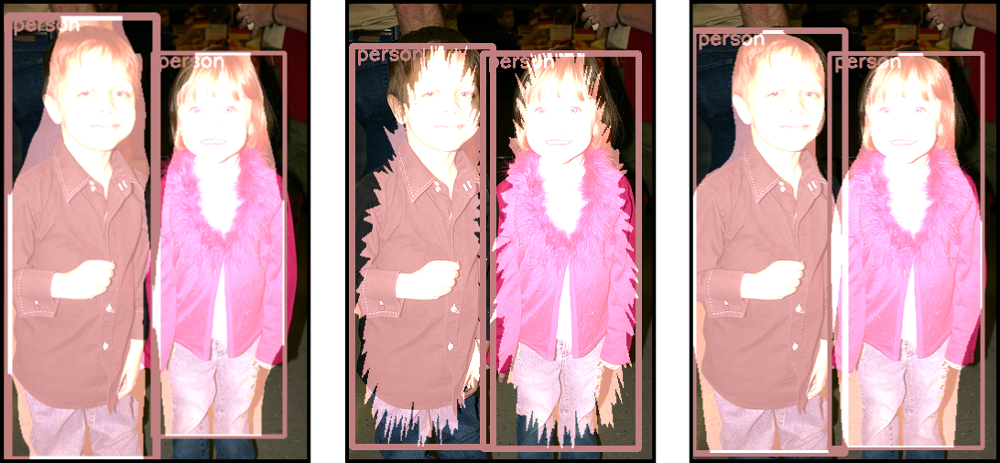

# Straight To Shapes: Real-Time Detection of Encoded Shapes



*Project page:* [http://www.robots.ox.ac.uk/~tvg/projects/StraightToShapes](http://www.robots.ox.ac.uk/~tvg/projects/StraightToShapes/index.php)

Current object detection approaches predict bounding boxes, but these provide little instance-specific information beyond location, scale and aspect ratio. In this work, we propose to directly regress to objects' shapes in addition to their bounding boxes and categories. It is crucial to find an appropriate shape representation that is compact and decodable, and in which objects can be compared for higher-order concepts such as view similarity, pose variation and occlusion. To achieve this, we use a denoising convolutional auto-encoder to establish an embedding space, and place the decoder after a fast end-to-end network trained to regress directly to the encoded shape vectors. This yields what to the best of our knowledge is the first real-time shape prediction network, running at ~35 FPS on a high-end desktop. With higher-order shape reasoning well-integrated into the network pipeline, the network shows the useful practical quality of generalising to unseen categories that are similar to the ones in the training set, something that most existing approaches fail to handle.

This version of the *StraightToShapes* concept was implemented by [Saumya Jetley](http://saumya-jetley.github.io/) and [Michael Sapienza](http://sites.google.com/site/mikesapi) and [Stuart Golodetz](http://research.gxstudios.net/), under the supervision of [Professor Philip Torr](http://www.robots.ox.ac.uk/~tvg).

It is built on top of [Darknet](https://github.com/pjreddie/darknet), an open-source neural network framework developed by [Joseph Redmon](http://pjreddie.com/).

## Publications

If you build on this framework for your research, please consider citing the original research paper:
```
@article{JetleySapienza2016,
  author    = {Saumya Jetley and
               Michael Sapienza and
               Stuart Golodetz and
               Philip H. S. Torr},
  title     = {Straight to Shapes: Real-time Detection of Encoded Shapes},
  journal   = {CoRR},
  volume    = {abs/1611.07932},
  year      = {2016},
  url       = {http://arxiv.org/abs/1611.07932},
}
```

# Installation Guide

## 1. Building the System

### 1.1 Overview

StraightToShapes builds with CMake 2.8 and above on Ubuntu.
It has been tested on 14.04 and 16.04.

### 1.2 Dependencies

StraightToShapes depends on various 3rd party libraries.

Suitable versions of the required dependencies and some of the optional
dependencies have been included in the repository, so StraightToShapes should
build "out of the box".

#### Dependencies which are bundled with StraightToShapes repo

```
  - Boost (version 1.59.0)
    Status: Required

  - Eigen (version 3.2.2)
    Status: Required

  - OpenCV (version 3.1.0)
    Status: Required
    Default: Enabled
```

#### Install-yourself dependencies

```
  - CUDA (version 7.5)
    Status: Optional (needed for GPU acceleration)
    Default: Enabled
    Flag: WITH_CUDA

  - OpenMP
    Status: Optional, but recommended (needed for faster training/prediction)
    Default: Disabled
    Flag: WITH_OPENMP
    Notes: Doesn't work on Mac OS X

  - Torch
    Status: Optional but strongly recommended (to use the autoencoder embeddings for shape prediction)
    Default: Disabled
    Flag: WITH_TORCH
    [Installation instructions](torch.ch/docs/getting-started.html)
```

### 1.3 Build Process

Common steps:

  1. Choose a root directory, hereafter referred to as <root>.

  2. Clone straighttoshapes into &lt;root&gt;/straighttoshapes, e.g.

     ```
     $ git clone git@github.com:torrvision/straighttoshapes.git
     ```

  3. Change to the straighttoshapes directory:

     ```
     $ cd straighttoshapes
     ```

#### 1.3.1 Build Process (Unix)

  1. Run the top-level build script:

     ```
     $ ./build-nix.sh "Unix Makefiles" Release
     ```

  2. Change to the build directory and run ccmake:

     ```
     $ cd build
     ```

     ```
     $ ccmake ..
     ```

  3. Enable any optional libraries (Like CUDNN, OPENMP, TORCH). Note that you will need to install these manually and supply the paths.

  4. Reconfigure and regenerate the makefile.

  5. Build with the optional libraries enabled, e.g.

     ```
     $ make -j4
     ```

## 2. Preparing some data
First prepare a data directory for the straighttoshapes application.

```
$ mkdir path/to/straighttoshapes/data
```

In the data directory, the straighttoshapes application expects to find three directories:
```
$ cd path/to/straightoshapes/data
$ mkdir models results datasets
```

datasets - to hold the datasets

models - to hold commonly used models

results - to output results from training or evaluation modes.


First let us populate the models directory with frequently used models by downloading them into the models directory:

```
$ cd models
```

- Initialisation

The weights used to initialise the network architecture for training (pre-trained on imagenet).
```
$ wget http://www.robots.ox.ac.uk/~tvg/projects/StraightToShapes/data/models/extraction.conv.weights
```

- Bounding box detection

The weights trained on SBD dataset, yolo configuration file, bounding box detection, 0 parameters per shape, trained on [train.txt](https://github.com/bharath272/sds_eccv2014/blog/master/train.txt).
```
$ wget http://www.robots.ox.ac.uk/~tvg/projects/StraightToShapes/data/models/sbd-yolo-bbox-c20-sp0-train.weights
```

- Shape prediction with 16x16 binary masks (256 dims) to represent the shapes.

The weights trained on SBD dataset, yolo configuration file, shape mask with 256 parameters per shape, trained on train, used to test on YouTube videos.
```
$ wget http://www.robots.ox.ac.uk/~tvg/projects/StraightToShapes/data/models/sbd-yolo-mask-c20-sp256-train.weights
```

The weights trained on SBD dataset, yolo configuration file, shape mask with 256 parameters per shape, trained on train and [val.txt](https://github.com/bharath272/sds_eccv2014/blog/master/val.txt) set, used to test on YouTube videos
```
$ wget http://www.robots.ox.ac.uk/~tvg/projects/StraightToShapes/data/models/sbd-yolo-mask-c20-sp256-trainval-demo.weights
```


## 3. Running the System

The build process will build various applications, libraries and test
programs in <root>/straighttoshapes/build. The main application can be found at:

```
$ <root>/build/bin/apps/vanilla/vanilla
```

It can be run "out of the box" from any working directory,
provided that suitable parameters are provided.

Examples:

#### In order to run the YOLO-style bounding box detection live from a webcam:

```
$ ./build/bin/apps/vanilla/vanilla -d /path/to/straighttoshapes/data -m demo --task detection
```

The arguments specify the location of the data directory '-d', the mode of use '-m', and the object encoding to use '--encoding'.
The application will automatically look for the file "sbd-yolo-bbox-c20-sp0-train.weights" in the data/models/ directory.

A path to a custom weights file may be provided using the '-w' option.
A list of all the input arguments can be output by running:

```
$ ./build/bin/apps/vanilla/vanilla --help
```

#### In order to run the YOLO-style bounding box detection on a single image:
```
$ ./build/bin/apps/vanilla/vanilla -d /path/to/straighttoshapes/data -m test --task detection -i ./apps/vanilla/resources/2008_001122.jpg -t 0.2
```

#### In order to run the StraightToShapes (STS) demo with 16x16 shape masks on an image, change the task to 'shapeprediction':
```
$ ./build/bin/apps/vanilla/vanilla -d /path/to/straighttoshapes/data -m test --task shapeprediction -i ./apps/vanilla/resources/2008_001122.jpg -t 0.2
```

#### In order to run the StraightToShapes (STS) demo with 16x16 shape masks on a disk based video file:
```
$ ./build/bin/apps/vanilla/vanilla -d /path/to/straighttoshapes/data -m demo -v /path/to/video/file.mp4 --task shapeprediction
```

## 4. Running the System with the learned embeddings

Go back to the models directory created previously, and create a new directory called autoencoder:
```
$ cd path/to/straightoshapes/data/models
$ mkdir autoencoder && cd autoencoder
```

#### Weights for the autoencoder

Next download the pre-learned models:
The weights used to initialise the autoencoder which reduces the dimensionality of the input to 20 dimensions
```
$ wget http://www.robots.ox.ac.uk/~tvg/projects/StraightToShapes/data/models/autoencoder/model_20.net
```

The weights used to initialise the autoencoder which reduces the dimensionality of the input to 50 dimensions
```
$ wget http://www.robots.ox.ac.uk/~tvg/projects/StraightToShapes/data/models/autoencoder/model_50.net
```

#### Weights for the shape prediction network
- Shape prediction with autoencoder embeddings (20 and 50 dims)

The weights trained on SBD dataset, yolo configuration file, shape embedding with 50 parameters per shape, trained on train and val set, used to test on YouTube videos
```
$ wget http://www.robots.ox.ac.uk/~tvg/projects/StraightToShapes/data/models/sbd-yolo-embedding-c20-sp50-trainval-demo.weights
```

- The weights trained on SBD dataset, yolo configuration file, shape embedding with 20 parameters per shape, trained on train, used to test on YouTube videos
```
$ wget http://www.robots.ox.ac.uk/~tvg/projects/StraightToShapes/data/models/sbd-yolo-embedding-c20-sp20-train.weights
```


***Make sure that the Torch dependency is installed*** 

Turn on the WITH_TORCH flag in Cmake.
```
$ cd straighttoshapes/build/
$ ccmake ..
```

Examples:
#### In order to run STS with a 50-dim shape AE representation on an image:
```
$ ./build/bin/apps/vanilla/vanilla -d /path/to/straighttoshapes/data -m test --task shapeprediction -i ./apps/vanilla/resources/2008_001122.jpg --encoding embedding --shapeparams 50 -t 0.2
```

#### In order to run STS with a 20-dim shape AE representation on an image:
```
$ ./build/bin/apps/vanilla/vanilla -d /path/to/straighttoshapes/data -m test --task shapeprediction -i ./apps/vanilla/resources/2008_001122.jpg --encoding embedding --shapeparams 20 -t 0.2
```

#### In order to run the STS demo live from a webcam:
```
$ ./build/bin/apps/vanilla/vanilla -d /path/to/straighttoshapes/data -m demo --task shapeprediction --encoding embedding --shapeparams 50
```


5. Training and evaluation
TODO: this requires the setup of the datasets..


# Licence

StraightToShapes © 2016, Torr Vision Group, The University of Oxford (the "Software")

The Software remains the property of the University of Oxford ("the University").

The Software is distributed "AS IS" under this Licence solely for non-commercial use in the hope that it will be useful, but in order that the University as a charitable foundation protects its assets for the benefit of its educational and research purposes, the University makes clear that no condition is made or to be implied, nor is any warranty given or to be implied, as to the accuracy of the Software, or that it will be suitable for any particular purpose or for use under any specific conditions. Furthermore, the University disclaims all responsibility for the use which is made of the Software. It further disclaims any liability for the outcomes arising from using the Software.

The Licensee agrees to indemnify the University and hold the University harmless from and against any and all claims, damages and liabilities asserted by third parties (including claims for negligence), which arise directly or indirectly from the use of the Software or the sale of any products based on the Software.

No part of the Software may be reproduced, modified, transmitted or transferred in any form or by any means, electronic or mechanical, without the express permission of the University. The permission of the University is not required if the said reproduction, modification, transmission or transference is done without financial return, the conditions of this Licence are imposed upon the receiver of the product, and all original and amended source code is included in any transmitted product. You may be held legally responsible for any copyright infringement that is caused or encouraged by your failure to abide by these terms and conditions.

You are not permitted under this Licence to use this Software commercially. Use for which any financial return is received shall be defined as commercial use, and includes:

1. integration of all or part of the source code or the Software into a product for sale or license by or on behalf of Licensee to third parties or 
2. use of the Software or any derivative of it for research with the final aim of developing software products for sale or license to a third party or 
3. use of the Software or any derivative of it for research with the final aim of developing non-software products for sale or license to a third party, or 
4. use of the Software to provide any service to an external organisation for which payment is received. 

If you are interested in using the Software commercially, please contact Torr Vision Group directly to negotiate a licence.

Contact details are: [philip.torr@eng.ox.ac.uk](mailto:philip.torr@eng.ox.ac.uk).
