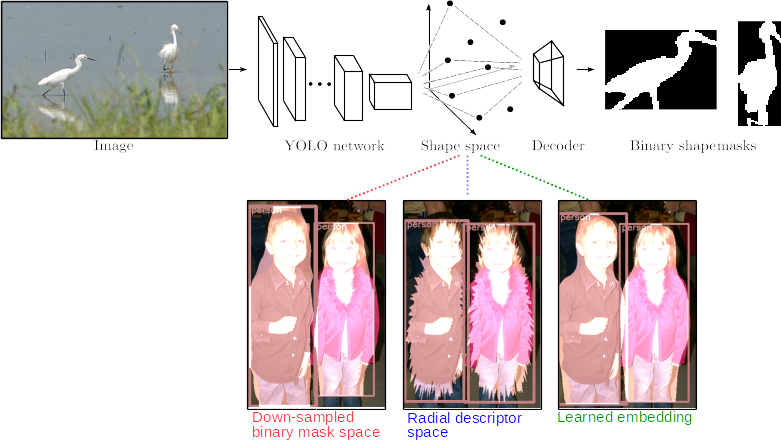

## Straight To Shapes: Real-Time Detection of Encoded Shapes



*Project page:* [http://www.robots.ox.ac.uk/~tvg/projects/StraightToShapes](http://www.robots.ox.ac.uk/~tvg/projects/StraightToShapes/index.php)

**Abstract** :This work accomplishes direct regression to objects' shapes in addition to their bounding boxes and categories by introducing a compact and decodable shape embedding space using a denoising autoencoder.
A deep convolutional network is trained to regress to the low dimensional shape vectors which are then mapped to shape masks using the decoder half of the autoencoder.
Our end-to-end network qualifies as the first real-time instance segmentation pipeline running at ~35FPS while yielding promising results at the task.
Proposed top-down regression to object shape masks through a semantically defined shape space allows the network to generalize to unseen categories at test time. We call this zero-shot segmentation and evaluate the performance of our model at the task to establish a baseline for future research to be measured against.

----

### Results


| Architecture  | Shape space  | Accuracy (mAP)|  --     | --    | Runtime (ms)| 
| ------------- |------------- |:-------------:|:------:|:------:|----------| 
|              |             |    mAP@0.5       | mAP@0.7 | mAP vol |          |
| YOLO   | Binary mask | 32.3 | 12.0 | 28.6 | 26.3 |
| YOLO   | Radial      | 30.0 | 6.5 | 29.0  | 27.1 |
| YOLO   | Embedding (50) | 32.6 | 14.8 | 28.9 | 30.5 |
| YOLO   | Embedding (20) | 34.6 | 15.0 | 31.5 | 28.0 |
| YOLO-BN| Embedding (20) |      |      |      |      |
| YOLO-BN-DA | Embedding (20) |  |      |      |      |


----

### Acknowledgements
This version of the *StraightToShapes* concept was implemented by [Saumya Jetley](http://saumya-jetley.github.io/) and [Michael Sapienza](http://sites.google.com/site/mikesapi) and [Stuart Golodetz](http://research.gxstudios.net/), under the supervision of [Professor Philip Torr](http://www.robots.ox.ac.uk/~tvg). Additional experiments with batch normalization, data augmentation and resnet architecture have been contributed by Laurynas Miksys.

It is built on top of [Darknet](https://github.com/pjreddie/darknet), an open-source neural network framework developed by [Joseph Redmon](http://pjreddie.com/).

If you build on this framework for your research, please consider citing the original research paper:
```
@article{JetleySapienza2016,
  author    = {Saumya Jetley and
               Michael Sapienza and
               Stuart Golodetz and
               Philip H. S. Torr},
  title     = {Straight to Shapes: Real-time Detection of Encoded Shapes},
  journal   = {CoRR},
  volume    = {abs/1611.07932},
  year      = {2016},
  url       = {http://arxiv.org/abs/1611.07932},
}
```
----

| Tables        | Are           | Cool  |
| ------------- |:-------------:| -----:|
| col 3 is      | right-aligned | $1600 |
| col 2 is      | centered      |   $12 |
| zebra stripes | are neat      |    $1 |

### Installation Guide

### 1. Building the System

#### 1.1 Overview

StraightToShapes builds with CMake 2.8 and above on Ubuntu.
It has been tested on 14.04 and 16.04.

#### 1.2 Dependencies

StraightToShapes depends on various 3rd party libraries.

Suitable versions of the required dependencies and some of the optional
dependencies have been included in the repository, so StraightToShapes should
build "out of the box".

#### Dependencies which are bundled with StraightToShapes repo

```
  - Boost (version 1.59.0)
    Status: Required

  - Eigen (version 3.2.2)
    Status: Required

  - OpenCV (version 3.1.0)
    Status: Required
    Default: Enabled
```

#### Install-yourself dependencies

```
  - CUDA (version 7.5)
    Status: Optional (needed for GPU acceleration)
    Default: Enabled
    Flag: WITH_CUDA

  - OpenMP
    Status: Optional, but recommended (needed for faster training/prediction)
    Default: Disabled
    Flag: WITH_OPENMP
    Notes: Doesn't work on Mac OS X

  - Torch
    Status: Optional but strongly recommended (to use the autoencoder embeddings for shape prediction)
    Default: Disabled
    Flag: WITH_TORCH
    [Installation instructions](torch.ch/docs/getting-started.html)
```

#### 1.3 Build Process

Common steps:

  1. Choose a root directory, hereafter referred to as <root>.

  2. Clone straighttoshapes into &lt;root&gt;/straighttoshapes, e.g.

     ```
     $ git clone git@github.com:torrvision/straighttoshapes.git
     ```

  3. Change to the straighttoshapes directory:

     ```
     $ cd straighttoshapes
     ```

#### 1.3.1 Build Process (Unix)

  1. Run the top-level build script:

     ```
     $ ./build-nix.sh "Unix Makefiles" Release
     ```

  2. Change to the build directory and run ccmake:

     ```
     $ cd build
     ```

     ```
     $ ccmake ..
     ```

  3. Enable any optional libraries (Like CUDNN, OPENMP, TORCH). Note that you will need to install these manually and supply the paths.

  4. Reconfigure and regenerate the makefile.

  5. Build with the optional libraries enabled, e.g.

     ```
     $ make -j4
     ```

### 2. Preparing some data
Prepare a data directory for the straighttoshapes application as follows:

```
$ mkdir path/to/straighttoshapes/data
```

In the data directory, the straighttoshapes application expects to find three directories:
```
$ cd path/to/straightoshapes/data
$ mkdir models results datasets
```

datasets - to hold the datasets

models - to hold commonly used models

results - to output results from training or evaluation modes.


First let us populate the models directory with frequently used models by downloading them into the models directory:

```
$ cd models
```

- Initialisation

The weights used to initialise the network architecture for training (pre-trained on imagenet).
```
$ wget http://www.robots.ox.ac.uk/~tvg/projects/StraightToShapes/data/models/extraction.conv.weights
```

- Bounding box detection

The weights trained on SBD dataset, yolo configuration file, bounding box detection, 0 parameters per shape, trained on [train.txt](https://github.com/bharath272/sds_eccv2014/blob/master/train.txt).
```
$ wget http://www.robots.ox.ac.uk/~scott/models/sbd-yolo-bbox-c20-sp0-train.weights
```

- Shape prediction with 16x16 binary masks (256 dims) to represent the shapes.

The weights trained on SBD dataset, yolo configuration file, shape mask with 256 parameters per shape, trained on train, used to test on YouTube videos.
```
$ wget http://www.robots.ox.ac.uk/~scott/models/sbd-yolo-mask-c20-sp256-train.weights
```

The weights trained on SBD dataset, yolo configuration file, shape mask with 256 parameters per shape, trained on train and [val.txt](https://github.com/bharath272/sds_eccv2014/blob/master/val.txt) set, used to test on YouTube videos
```
$ wget http://www.robots.ox.ac.uk/~tvg/projects/StraightToShapes/data/models/sbd-yolo-mask-c20-sp256-trainval-demo.weights
```


### 3. Running the System

The build process will build various applications, libraries and test
programs in <root>/straighttoshapes/build. The main application can be found at:

```
$ <root>/build/bin/apps/vanilla/vanilla
```

It can be run "out of the box" from any working directory,
provided that suitable parameters are provided.

Examples:

#### In order to run the YOLO-style bounding box detection live from a webcam:

```
$ ./build/bin/apps/vanilla/vanilla -d /path/to/straighttoshapes/data -m demo --task detection
```

A list of all the input arguments can be output by running:

```
$ ./build/bin/apps/vanilla/vanilla --help
```

The arguments specify the location of the data directory '-d', the mode of use '-m', and the object encoding to use '--encoding'.
The application will automatically look for the file "sbd-yolo-bbox-c20-sp0-train.weights" in the data/models/ directory.

A path to a custom weights file may be provided using the '-w' option.

#### In order to run the YOLO-style bounding box detection on a single image:
```
$ ./build/bin/apps/vanilla/vanilla -d /path/to/straighttoshapes/data -m test --task detection -i ./apps/vanilla/resources/2008_001122.jpg -t 0.2
```

#### In order to run the StraightToShapes (STS) demo with 16x16 shape masks on an image, change the task to 'shapeprediction':
```
$ ./build/bin/apps/vanilla/vanilla -d /path/to/straighttoshapes/data -m test --task shapeprediction -i ./apps/vanilla/resources/2008_001122.jpg -t 0.2
```

#### In order to run the StraightToShapes (STS) demo with 16x16 shape masks on a disk based video file:
```
$ ./build/bin/apps/vanilla/vanilla -d /path/to/straighttoshapes/data -m demo -v /path/to/video/file.mp4 --task shapeprediction
```

### 4. Running the System with the learned embeddings

Go back to the models directory created previously, and create a new directory called autoencoder:
```
$ cd path/to/straightoshapes/data/models
$ mkdir autoencoder && cd autoencoder
```

#### Weights for the autoencoder

The weights used to initialise the autoencoder which reduces the dimensionality of the binary shape masks to 20 dimensions
```
$ wget http://www.robots.ox.ac.uk/~tvg/projects/StraightToShapes/data/models/autoencoder/model_20.net
```

The weights used to initialise the autoencoder which reduces the dimensionality of the binary shape masks to 50 dimensions
```
$ wget http://www.robots.ox.ac.uk/~tvg/projects/StraightToShapes/data/models/autoencoder/model_50.net
```

#### Weights for the core network (YOLO style regressor)
- Shape prediction with autoencoder embeddings (20 and 50 dims)

The weights trained on SBD dataset, yolo configuration file, shape embedding with 50 parameters per shape, trained on train and val set, used to test on YouTube videos
```
$ wget http://www.robots.ox.ac.uk/~tvg/projects/StraightToShapes/data/models/sbd-yolo-embedding-c20-sp50-trainval-demo.weights
```

- The weights trained on SBD dataset, yolo configuration file, shape embedding with 20 parameters per shape, trained on train, used to test on YouTube videos
```
$ wget http://www.robots.ox.ac.uk/~scott/models/sbd-yolo-embedding-c20-sp20-train.weights
```


***Make sure that the Torch dependency is installed***

***Also required is the DPNN package which can be installed as follows***
```
$ luarocks install dpnn
```

Turn on the WITH_TORCH flag in Cmake.
```
$ cd straighttoshapes/build/
$ ccmake ..
```
Then re-make
```
make
```

Now we are all set to try the following examples:
#### In order to run STS with a 50-dim shape AE representation on an image:
```
$ ./build/bin/apps/vanilla/vanilla -d /path/to/straighttoshapes/data -m test --task shapeprediction -i ./apps/vanilla/resources/2008_001122.jpg --encoding embedding --shapeparams 50 -t 0.2
```

#### In order to run STS with a 20-dim shape AE representation on an image:
```
$ ./build/bin/apps/vanilla/vanilla -d /path/to/straighttoshapes/data -m test --task shapeprediction -i ./apps/vanilla/resources/2008_001122.jpg --encoding embedding --shapeparams 20 -t 0.2
```

#### In order to run the STS demo live from a webcam:
```
$ ./build/bin/apps/vanilla/vanilla -d /path/to/straighttoshapes/data -m demo --task shapeprediction --encoding embedding --shapeparams 50
```


5. Training and evaluation
TODO: this requires the setup of the datasets.


6. Build Problems.
#### Build directory not created, OpenCV fails to build.
On some systems, OpenCV will fail to build. In this case, open the file
```
$ gedit libraries/build-opencv-3.1.0.log
```
to check why it failed. If this is caused by the IPP flag, turn it off and recompile without IPP.

-------


